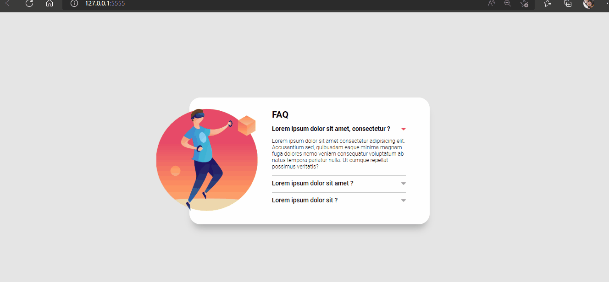
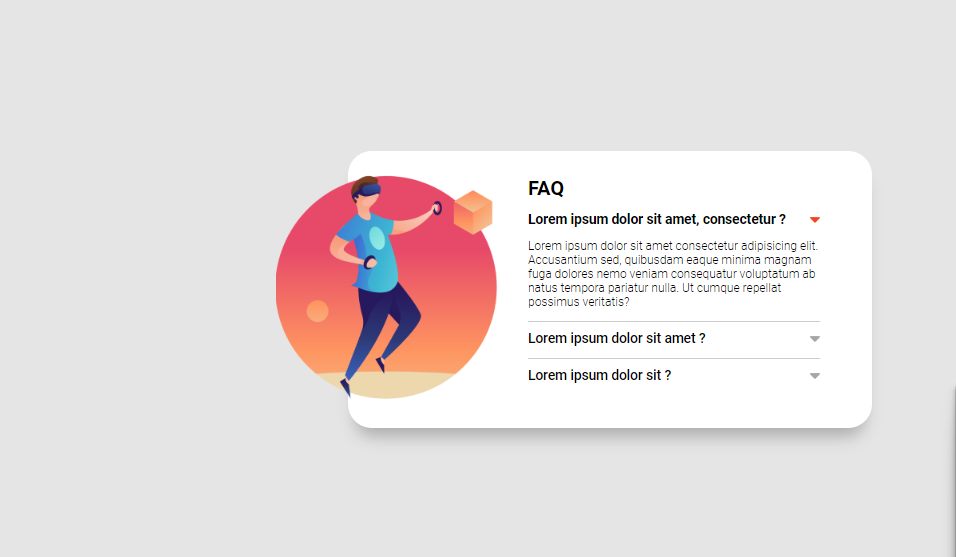

### Projeto acordeon 🙌
### Desafios encontrados centralizar elementos criar efeito acordeon nas perguntas e respostas.

### Ao clicar em uma pergunta deve acontecer uma animação de acordeon para abrir o item e mostrar o texto escondido, e a seta deve mudar de cor.
### Ao clicar em um item para abri-lo todos os outros itens devem ser fechados.
### Referência do que é um efeito acordeon https://www.netflix.com/br/ na seção "Perguntas Frequentes".

[]

[]

### Tecnologias Utilizadas

  
    
  
  

  ### Márcia